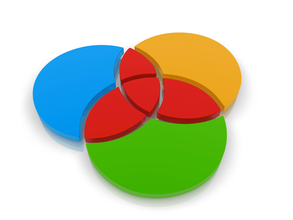
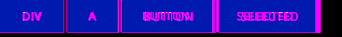
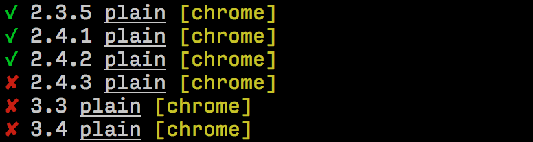

---

layout: sc5

style: |

    #Cover .main-logo__wrapper {
        width: 100%;
        text-align: center;
    }
    #Cover object.main-logo {
        z-index: 5;
        position: static;
        width: 200px;
        margin: 35px 50px;
    }

    #Cover h2 {
        margin:30px 0 0;
        color:#FFF;
        text-align:center;
        font-size:70px;
        }
    #Cover p {
        margin:10px 0 0;
        text-align:center;
        color:#FFF;
        font-style:italic;
        font-size:20px;
        }
        #Cover p a {
            color:#FFF;
            }
    #Picture h2 {
        color:#FFF;
        }
    #SeeMore h2 {
        font-size:100px
        }
    #SeeMore img {
        width:0.72em;
        height:0.72em;
        }
---

# Сначала стайлгайд {#Cover}

или

### как перейти на компонентный подход

    <object class="main-logo" data="themes/sc5/images/logo.min.svg#white" type="image/svg+xml"></object>

*Brought to you by [Varya Stepanova](http://varya.me/) and generated by [Jekyller](https://github.com/shower/jekyller)*
{: .credits }

## Варя Степанова
{: .varya }

Разработчик интерфейсов 
[SC5 Online](http://sc5.io), Хельсинки 
[@toivonens](https://twitter.com/toivonens){: .twitter }

Долгоживущие проекты, библиотеки компонентов,
**style-guide-driven development**

<!--
About keeping things in order.
About programming lazyness.
About not driving a stick.
About robots should work and people should not.
About organizing things for a better life.
About fly lady.
-->

## Улучшение процесса разработки
{: .chapter }

## Метод старой школы
{: .cycle }

макет

вёрстка

продукт

<!--How it used to be-->

## Процесс с потерями
{: .dash-process }

### Должно быть так

макет

вёрстка

интеграция

### Но нет :-)

макет

вёрстка

  
вёрстка

  
макет

  
вёрстка

 
...снова и снова!

<!-- TODO: Better colors -->

## Метод старой школы
{: .old-school }

* Интерфейс неоднородный
* Запутанный код
* Маленькие изменения на самом деле большие
* Занимает много времени
* <b>Сложно поддерживать</b>
{: .list }

<!-- time conhard to edit/change/keep up-to-date)-->

## Websites are systems
{: .anna}

<!-- What we are actually developing -->
> Сайты — это системы, а не страницы. И чем скорее мы перестанем считать их страницами, тем лучше.
<figcaption>Анна Дебенхэм</figcaption>

## Модульный CSS

* OOCSS
* SMACSS
* BEM
* Atomic design

или любое другое решение
{: .note }

## Процесс разрабоки с модульным CSS
{: .component-cycle }

## Выход из зоны комфорта
{: .challenge }

## Живой стайлгайд
{: .living-styleguide }

<b>Живой стайлгайд</b> — это сайт с документацией, на котором компоненты отрисованы при помощи того
же CSS, что используется в рабочем проекте.

Например,

* [Lonely Planet's Style Guide](http://rizzo.lonelyplanet.com/styleguide/design-elements/colours)
* [A Pattern Apart](http://patterns.alistapart.com/)
* [Anna Debenham's Style Guide](http://style.maban.co.uk/)

## Разработка при помощи стайлгайда

### style-guide-driven development
{: .subtitle }

Стайлгайд <s>можно</s> нужно вписать в процесс разработки.

<b>Сначала стайлгайд</b>: разрабатываем и фиксим в живом стайлгайде, а потом переносим в продукт.

## Инструмент
{: .tool }

[styleguide.sc5.io](http://styleguide.sc5.io)

## Легко сделать стайлгайд

* `npm install sc5-styleguide`
* CSS, SCSS, SASS, LESS
* Совместимо с Gulp и Grunt
* Живой стайлгайд
* Документация в коде, KSS-синтаксис
* Шаблоны (AngularJS директивы)

## Можно использовать для разработки

* Следит за изменениями и обновляется
* Показывает переменные компонента
* Показывает компоненты переменных
* Быстрое редактирование

## Наш опыт: библиотека компонент
{: .cross-company }

## Визуальные юнит тесты
{: .unit-tests }

Было: 

Стало: 

Видно на тесте: 

{: .next }

## Автоматизировано
{: .automate }

* `gulp test:visual:update` — обновляет базу скриншотов
* `gulp test:visual` — сравнивает локальную копию с базой

### Можно использовать для **continuous integration**!

## Что нам дал SC5 Style Guide
{: .benefits }

* Живая документация компонентов
* Быстрое тестирование
* Юнит тесты для интерфейса
* Быстрая разработка новых страниц
* {: .unit-4 } Консистентный дизайн
* Улучшает понимание в команде
* Хорошо для удаленной работы
* {: .unit-2 } Делаем одно дело
* {: .main } <b>Разработка "сначала стайлгайд"</b>

## Изменения в мозгу
{: .mindset }

###До

Какой CSS и JS нужен?

### После
Какие модули нужны для этой страницы? Нужно ли сделать новые компоненты? 
**Новые компоненты разрабатываются в стайлгайде.**

## Спасибо!
{: .thanks }

Варя Степанова, SC5 Online 
[@toivonens](https://twitter.com/toivonens){: .twitter }

### [varya.me/func-2015](http://varya.me/func-2015/)

